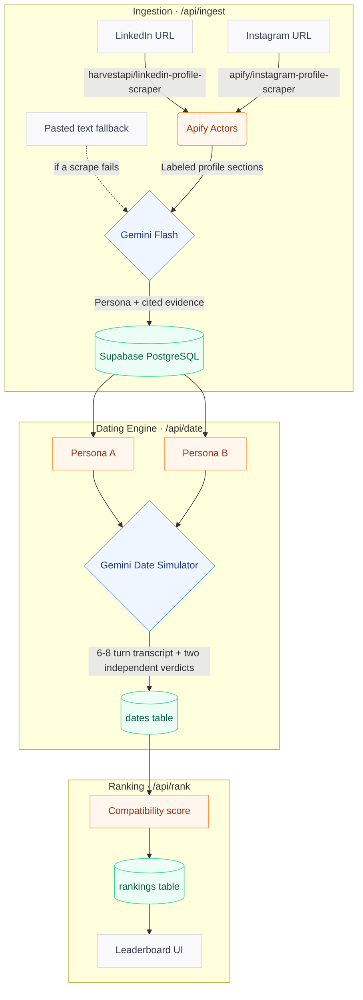

# PersonaMatch: Agentic AI Dating Simulator

PersonaMatch is an automated, agentic dating platform where AI personas date on behalf of real people. By scraping public LinkedIn and Instagram profiles, the system extracts each person's needs, hobbies, interests, values, and communication style. These personas then go on simulated multi-turn first dates, score each other independently, and produce a ranked leaderboard of the most compatible matches.

Built for speed and depth, PersonaMatch uses parallel web scraping and single-shot LLM simulations to turn messy social profiles into measurable compatibility.

---

## 🏗️ Architecture Flow



---

## ✨ Core Features

* **Evidence-Based Personas:** Every extracted need, hobby, interest, and value is linked to a verbatim quote from a specific LinkedIn section or Instagram post. Claims whose citation doesn't match a real section are dropped, and each quote is checked against its source.
* **Fallback Ingestion:** If a live scrape fails (private/deleted account, blocked scraper), the UI switches that platform to a manual text-paste mode, so the pipeline never breaks. Successful scrapes are cached so a retry doesn't pay for them twice.
* **Autonomous Dating Simulation:** Each persona speaks in its human's communication style (corporate keynote vs. casual emojis), and each side independently scores the date and decides whether it wants a second one.
* **Transparent Ranking:** `compatibility_score = score_a + score_b + 10 if both want a second date` (0–30), with a one-line Gemini-written reason per candidate.
* **Built for Time Limits:** Missing dates run in batches of 3 (up to 10 per request) inside a time budget that keeps every route under `maxDuration = 300`. If Gemini is overloaded, requests fall back across several Flash models automatically.

---

## 🛠️ Tech Stack

| Component | Technology | Purpose |
| --- | --- | --- |
| **Framework** | Next.js 16 (App Router) | Frontend UI & serverless API routes |
| **Styling** | Tailwind CSS 4 & Lucide icons | Responsive, dark-mode-aware UI |
| **Database** | Supabase (PostgreSQL) | Persistent storage; RLS enabled, server-only access via the service-role key |
| **Web Scraping** | Apify Actors | LinkedIn and Instagram public profile extraction |
| **LLM Engine** | Google Gemini 3.8 Flash (with 3.6 / 3.7 / 3.1-lite fallbacks) | Structured JSON extraction, date simulation, ranking reasons |

---

## 🗄️ Database Schema

Defined in [`supabase/schema.sql`](supabase/schema.sql):

| Table | Key Columns | Description |
| --- | --- | --- |
| `profiles` | `id`, `name`, `linkedin_url`, `instagram_url`, `needs`, `hobbies`, `interests`, `values`, `communication_style`, `evidence` | The parsed persona, its source citations, and the cleaned raw scrape data. |
| `dates` | `id`, `person_a_id`, `person_b_id`, `transcript`, `venue`, `shared_interest`, `score_a/b`, `reason_a/b`, `second_date_a/b` | One simulated date: the 6–8 turn conversation and both independent verdicts. |
| `rankings` | `id`, `person_id`, `candidate_id`, `rank`, `compatibility_score`, `reasoning` | The latest leaderboard for each person (score out of 30). |

All three tables have row-level security enabled with no policies, so the public anon key can't read or write them; only server routes using the service-role key can.

---

## 🔌 API

| Route | Body | What it does |
| --- | --- | --- |
| `POST /api/ingest` | `{ linkedin_url, instagram_url, name?, linkedin_text?, instagram_text? }` | Scrapes both profiles (or uses pasted text), extracts the persona, saves it. Returns `422` with `needs_manual` if a scrape fails. |
| `POST /api/date` | `{ person_a_id, person_b_id }` | Simulates one date and saves it. |
| `POST /api/rank` | `{ person_id }` | Runs missing dates (up to 10 per call, 3 at a time), scores every candidate, and replaces that person's rankings. |

---

## 📁 Project Structure

```
src/
├── app/
│   ├── page.tsx                      # Home: ingest form + recent profiles
│   ├── profile/[id]/page.tsx         # Persona, tags, evidence
│   ├── profile/[id]/rankings/page.tsx# Leaderboard
│   ├── profile/[id]/dates/page.tsx   # Dates + chat transcripts
│   └── api/{ingest,date,rank}/route.ts
├── components/                       # Interactive pieces (form, buttons, date list)
│   └── ui/                           # Shared UI: button, card, badge, score, chat bubbles
└── lib/
    ├── apify.ts                      # Scrapers, URL parsing, labeled sections
    ├── llm.ts                        # Gemini calls, schemas, validation
    ├── prompts.ts                    # Prompt templates
    ├── dates.ts                      # Shared date simulation + insert
    ├── queries.ts                    # Server-side reads for pages
    └── supabase.ts                   # Service-role client
supabase/schema.sql                   # Database schema
scripts/setup-db.mjs                  # Applies the schema
```

---

## 🚀 Local Setup

1. **Clone the repository and install dependencies:**

   ```bash
   git clone https://github.com/your-username/personamatch.git
   cd personamatch
   npm install
   ```

2. **Configure environment variables:** copy `.env.example` to `.env.local` and fill in your keys.

   ```env
   NEXT_PUBLIC_SUPABASE_URL=your_supabase_project_url
   NEXT_PUBLIC_SUPABASE_ANON_KEY=your_supabase_anon_key
   SUPABASE_SERVICE_ROLE_KEY=your_supabase_service_role_key
   SUPABASE_DB_PASSWORD=your_supabase_db_password
   APIFY_API_TOKEN=your_apify_api_token
   GEMINI_API_KEY=your_gemini_api_key
   ```

3. **Initialize the database:**

   ```bash
   npm run db:setup
   ```

4. **Run the development server:**

   ```bash
   npm run dev
   # The app starts on http://localhost:3005
   ```

---

## ☁️ Deploying to Vercel

Add `NEXT_PUBLIC_SUPABASE_URL`, `SUPABASE_SERVICE_ROLE_KEY`, `APIFY_API_TOKEN`, and `GEMINI_API_KEY` as environment variables in the Vercel project (`NEXT_PUBLIC_SUPABASE_ANON_KEY` is optional; `SUPABASE_DB_PASSWORD` is only needed locally), then deploy with `vercel --prod`.
