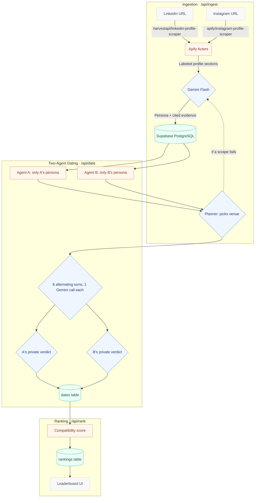

# PersonaMatch: Agentic AI Dating Simulator

PersonaMatch is an automated, agentic dating platform where AI personas date on behalf of real people. By scraping public LinkedIn and Instagram profiles, the system extracts each person's needs, hobbies, interests, values, and communication style. These personas then go on simulated multi-turn first dates, score each other independently, and produce a ranked leaderboard of the most compatible matches.

Each date is a real two-agent conversation: every persona is its own Gemini agent that only knows its own profile and what the other person says on the date, then privately decides whether it wants a second date.

---

## 🏗️ Architecture Flow



---

## ✨ Core Features

* **Consent First:** Nobody is scraped or stored unless they opt in. Preferences (looking for, age, partner age range, city) are self-declared at ingest and never inferred from social media, and they act as hard filters: a pair that fails either person's preferences is never dated or ranked.
* **Evidence-Based Personas:** Every stored need, hobby, interest, and value is linked to a quote from a specific LinkedIn section or Instagram post. A citation is kept only if its section exists and its quote appears verbatim in that section (ignoring case and whitespace); claims left without a verified citation are dropped.
* **Fallback Ingestion:** If a live scrape fails (private/deleted account, blocked scraper), the UI switches that platform to a manual text-paste mode, so the pipeline never breaks. Successful scrapes are cached so a retry doesn't pay for them twice.
* **True Two-Agent Dates:** A planner call (the only one that sees both personas) picks the venue. Then the two agents alternate for 8 turns, one Gemini call per turn; each agent's prompt holds only its own persona, the other person's name, the venue and the transcript so far, so they learn about each other only by talking. Afterwards each agent privately scores the date (0–10, citing a moment) and decides on a second date. Who opens, and who is stored as person A, is randomised.
* **Personal Over Professional:** Dates and rankings weight hobbies, interests and values (mostly from Instagram) above shared profession or industry (LinkedIn), because in our first test run every tech-industry pair "bonded" over AI and smart glasses, even when one person's real hobbies were pottery and trekking.
* **Transparent Ranking:** `compatibility_score = score_a + score_b + 10 if both want a second date` (0–30), with a one-line Gemini-written reason per candidate.
* **Built for Limits:** A date is 11 Gemini calls (~15s measured). Missing dates run 3 at a time, up to 10 per request, inside a time budget that keeps `/api/rank` under `maxDuration = 300`; the "Run Dates" button repeats the request until everyone is dated and the leaderboard flags anything still missing. Gemini's free tier allows ~20 requests per model per day, so calls rotate through a pool of Flash and Flash-Lite models, skipping any that are out of quota or overloaded.
* **Ingest Safeguards:** Scrapes are cached in Supabase for 24h; re-ingesting a LinkedIn URL updates that profile; private or empty Instagram accounts fall back to pasted text; and if the LinkedIn and Instagram names clearly differ, the UI asks you to confirm it's the same person.
* **Abuse Protection:** Per-IP limits (5 ingests and 30 rank calls per hour, stored hashed in Supabase) and a hard cap of 60 profiles.

---

## 📊 Evaluation

`npm run eval` measures the system over the real people in the database (fictional samples excluded by default) and writes `EVAL.md`:

| Metric | What it measures |
| --- | --- |
| Citation verification | Share of the citations Gemini proposed that verified verbatim against their source section, per profile and overall |
| Claim sources | Share of stored claims that came from Instagram vs LinkedIn |
| Scores | Distribution of date scores, and how often both sides agree on a second date |
| Position bias | Mean score given when speaking first vs second |
| Consistency | Score variance when 5 random pairs are re-simulated (re-runs aren't stored) |

---

## 👥 Adding People

PersonaMatch only includes **consenting people**: each person agrees to have their public LinkedIn and Instagram used before they're added. One at a time, use the form on the home page (the consent box is required). In bulk, list them in `scripts/people.json` (copy `scripts/people.example.json`; the file is git-ignored because it holds people's details), recording `"consent": true` only after each person agreed, then run `npm run ingest:people`. It ingests everyone, then dates and ranks the whole pool until the rankings are complete.

**Sandbox (fictional samples).** While the real pool is small, `npm run seed:demo` adds 8 clearly made-up sample profiles (`scripts/demo-profiles.json`). Samples only date each other and real people who explicitly opt in to the sandbox (the form's sandbox checkbox, or `"sandbox_opt_in": true` in `people.json`). Real-to-real dating is unaffected. Every date and ranking involving a sample carries a "Fictional sample" badge, rankings show real and sample match counts separately, and `npm run eval` excludes samples unless `EVAL_INCLUDE_SAMPLES=1`.

---

## 🛠️ Tech Stack

| Component | Technology | Purpose |
| --- | --- | --- |
| **Framework** | Next.js 16 (App Router) | Frontend UI & serverless API routes |
| **Styling** | Tailwind CSS 4 & Lucide icons | Responsive, dark-mode-aware UI |
| **Database** | Supabase (PostgreSQL) | Persistent storage; RLS enabled, server-only access via the service-role key |
| **Web Scraping** | Apify Actors | LinkedIn and Instagram public profile extraction |
| **LLM Engine** | Google Gemini Flash / Flash-Lite pool (3.8 Flash first for extraction) | Structured JSON extraction, two-agent dates, verdicts, ranking reasons |

---

## 🗄️ Database Schema

Defined in [`supabase/schema.sql`](supabase/schema.sql):

| Table | Key Columns | Description |
| --- | --- | --- |
| `profiles` | `id`, `name`, `linkedin_url`, `instagram_url`, `needs`, `hobbies`, `interests`, `values`, `communication_style`, `evidence`, `opted_in`, `looking_for`, `age`, `age_range_min`, `age_range_max`, `city`, `citation_stats`, `is_sample`, `sandbox_opt_in` | The parsed persona, its verified citations, the cleaned raw scrape data, and the person's consent and self-declared preferences. `linkedin_url` is unique. |
| `dates` | `id`, `person_a_id`, `person_b_id`, `transcript`, `venue`, `shared_interest`, `score_a/b`, `reason_a/b`, `second_date_a/b` | One simulated date: the 6–8 turn conversation and both independent verdicts. |
| `rankings` | `id`, `person_id`, `candidate_id`, `rank`, `compatibility_score`, `reasoning` | The latest leaderboard for each person (score out of 30). |
| `scrape_cache` | `normalized_url`, `platform`, `data`, `fetched_at` | Apify results, reused for 24h. |
| `rate_limits` | `bucket`, `ip_hash`, `created_at` | Per-IP request log for rate limiting (IPs stored as SHA-256 hashes). |

All tables have row-level security enabled with no policies, so the public anon key can't read or write them; only server routes using the service-role key can.

---

## 🔌 API

| Route | Body | What it does |
| --- | --- | --- |
| `POST /api/ingest` | `{ opted_in: true, linkedin_url, instagram_url, name?, linkedin_text?, instagram_text?, looking_for?, age?, age_range_min?, age_range_max?, city?, confirm_identity?, sandbox_opt_in? }` | Requires consent (`400` otherwise). Scrapes both profiles (or uses pasted text), extracts the persona, saves it with the declared preferences; re-ingesting a LinkedIn URL updates that profile (`200`). `422` + `needs_manual` if a scrape fails or Instagram is private/empty, `409` if the two names clearly differ, `429` over the rate limit, `403` when the pool is full. |
| `POST /api/date` | `{ person_a_id, person_b_id }` | Runs one two-agent date and saves it. Returns `422` with `reasons` if either person isn't opted in or the pair fails someone's preferences. |
| `POST /api/rank` | `{ person_id }` | Considers only opted-in candidates that pass both people's preferences (the rest are listed in `filtered_out`), runs missing dates (up to 10 per call, 3 at a time), scores them, and replaces that person's rankings. |

---

## 📁 Project Structure

```
src/
├── app/
│   ├── page.tsx                      # Home: ingest form + recent profiles
│   ├── profile/[id]/page.tsx         # Persona, tags, evidence
│   ├── profile/[id]/rankings/page.tsx# Leaderboard
│   ├── profile/[id]/dates/page.tsx   # Dates + chat transcripts
│   └── api/{ingest,date,rank}/route.ts
├── components/                       # Interactive pieces (form, buttons, date list)
│   └── ui/                           # Shared UI: button, card, badge, score, chat bubbles
└── lib/
    ├── apify.ts                      # Scrapers, URL parsing, labeled sections
    ├── llm.ts                        # Gemini model pool, persona extraction, two-agent date loop
    ├── prompts.ts                    # Prompt templates
    ├── dates.ts                      # Shared date simulation + insert
    ├── matching.ts                   # Consent + preference hard filters
    ├── rate-limit.ts                 # Per-IP limits + profile cap
    ├── queries.ts                    # Server-side reads for pages
    └── supabase.ts                   # Service-role client
supabase/schema.sql                   # Database schema
scripts/setup-db.mjs                  # Applies the schema
scripts/ingest-people.mjs             # Ingests consenting real people (scripts/people.json), then dates + ranks them
scripts/seed-demo.mjs                 # Adds the fictional sample profiles (sandbox)
scripts/eval.ts                       # Writes EVAL.md (npm run eval)
```

---

## 🚀 Local Setup

1. **Clone the repository and install dependencies:**

   ```bash
   git clone https://github.com/yerramsettysuchita/PersonaMatch.git
   cd PersonaMatch
   npm install
   ```

2. **Configure environment variables:** copy `.env.example` to `.env.local` and fill in your keys.

   ```env
   NEXT_PUBLIC_SUPABASE_URL=your_supabase_project_url
   NEXT_PUBLIC_SUPABASE_ANON_KEY=your_supabase_anon_key
   SUPABASE_SERVICE_ROLE_KEY=your_supabase_service_role_key
   SUPABASE_DB_PASSWORD=your_supabase_db_password
   APIFY_API_TOKEN=your_apify_api_token
   GEMINI_API_KEY=your_gemini_api_key
   ```

3. **Initialize the database:**

   ```bash
   npm run db:setup
   ```

4. **Run the development server:**

   ```bash
   npm run dev
   # The app starts on http://localhost:3005
   ```

---

## ☁️ Deploying to Vercel

Add `NEXT_PUBLIC_SUPABASE_URL`, `SUPABASE_SERVICE_ROLE_KEY`, `APIFY_API_TOKEN`, and `GEMINI_API_KEY` as environment variables in the Vercel project (`NEXT_PUBLIC_SUPABASE_ANON_KEY` is optional; `SUPABASE_DB_PASSWORD` is only needed locally), then deploy with `vercel --prod`.
